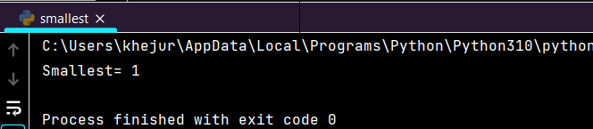

<h1 align="center"> AI_Lab_clp1 </h1>
<h2>Table of Contents</h2>
    <table border="1" align="center">
        <tr>
            <th>Task</th>
            <th>File Name</th>
        </tr>
        <tr>
            <td><a href="#odd-even">Sum of Odd and Even Numbers</a></td>
            <td><a href="sumofOddEven.py">sumofOddEven</a></td>
        </tr>
        <tr>
            <td><a href="#smallest-number">Find Smallest Number</a></td>
            <td><a href="smallest.py">smallest</a></td>
        </tr>
        <tr>
            <td><a href="#sum-divisible">Sum of Numbers Divisible by 3 but Not by 5</a></td>
            <td><a href="sum&Div.py">sum&Div</a></td>
        </tr>
        <tr>
            <td><a href="#second-highest">Second Highest Number</a></td>
            <td><a href="high2nd.py">high2nd</a></td>
        </tr>
        <tr>
            <td><a href="#factorial">Factorial using For Loop</a></td>
            <td><a href="factorial.py">Factorial</a></td>
        </tr>
        <tr>
            <td><a href="#fibonacci">Fibonacci Series</a></td>
            <td><a href="fibonacci.py">fibonacci</a></td>
        </tr>
        <tr>
            <td><a href="#largest-number">Largest Number Between Two Numbers</a></td>
            <td><a href="largest.py">largest</a></td>
        </tr>
        <tr>
            <td><a href="#sum-parameters">Sum of Numbers Passed as Parameters</a></td>
            <td><a href="sum.py">sum</a></td>
        </tr>
    </table>
<h2>Task Description and Output </h2>    
    <dl type="circle">
        <dt><h4 id="odd-even">1. Sum of odd and even numbers</h4></dt>
        <dd>
            
This program calculates the sum of odd and even numbers from a given set of numbers.

            
<strong>Example Output:</strong>

            
        </dd>
        <dt><h4 id="smallest-number">2. Find the smallest number</h4></dt>
        <dd>
            
This program identifies the smallest number from a given set of numbers.

            
<strong>Example Output:</strong>

            
        </dd>
        <dt><h4 id="sum-divisible">3. Sum of Numbers Divisible by 3 but Not by 5</h4></dt>
        <dd>
            
This program calculates the sum of numbers between 50 and 100 that are divisible by 3 but not by 5.

            <pre>Sum: 798</pre>
            
        </dd>
        <dt><h4 id="second-highest">Second Highest Number</h4></dt>
        <dd>
            
This program finds the second highest number from a given set of numbers.

            <pre>Second highest number: 45</pre>
            
        </dd>
        <dt><h4 id="factorial">Factorial using For Loop</h4></dt>
        <dd>
            
This program calculates the factorial of a given number using a for loop.

            
        </dd>
        <dt><h4 id="fibonacci">Fibonacci Series</h4></dt>
        <dd>
            
This program generates the Fibonacci series up to a specified number of terms.

            
        </dd>
        <dt><h4 id="largest-number">Largest Number Between Two Numbers</h4></dt>
        <dd>
            
This program determines the largest number between two numbers using a function.

            
        </dd>
        <dt><h4 id="sum-parameters">Sum of Numbers Passed as Parameters</h4></dt>
        <dd>
            
This program calculates the sum of numbers passed as function parameters.

            
        </dd>
    </dl>
